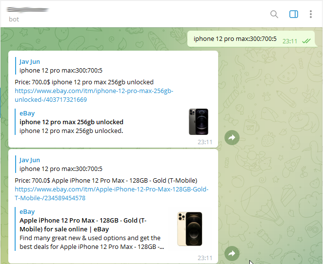

# Telegram Bot Ebay Shooter `v.1.0.150622`

### What used in project?

* Java
* Maven
* Telegram API
* Ebay API Request XML

## Description
This bot was maked as my first project. The main goal is searching newest listings on Ebay used based filters: `keyword`,`min price`,`max price`,`qty items` and return result into Telegrom Bot.

##  

### How it work?

## Request example

```
Iphone 12 Pro Max:300:500:5
```
Delimeter in request `:`
### Where

* Iphone 12 Pro Max - is keyword
* 300 - min price $
* 500 - max price $
* 5 - last newest listings
## Settings
####Set your Ebay API in class ReadXmlDomParser
```
private final String EBAY_API = "EbayApi";
```

If you haven't personal Bot, you can make it via link: [BotFather](https://t.me/BotFather)
####Set your Bot name and Telegram Token in class Bot
```
private final String BOT_NAME = "BotName";
private final String BOT_TOKEN = "TelegramToken";
```
## Contact
[LinkedIn](https://www.linkedin.com/in/andrey-nemeritskyy-08ab31212/) for deals. If you have questions or ideas you can write me via link: [@nemeritskyy](https://t.me/nemeritskyy).

## Donation
>If this project help you reduce time to develop, you can give me a cup of coffee :)

[](andrey.nemeritskyy@gmail.com)